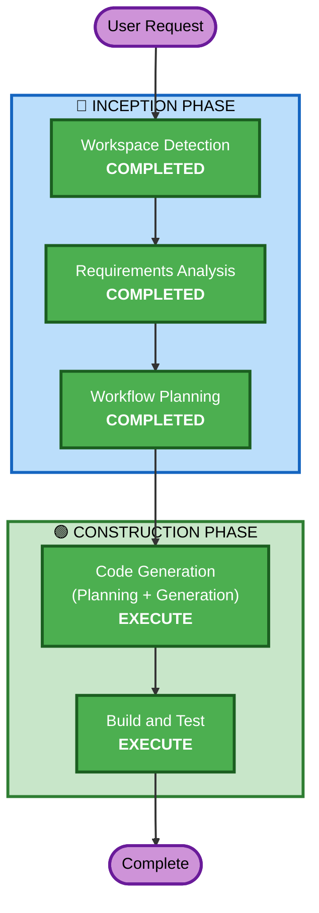

# Execution Plan — Kiro Diagramming Power

## Detailed Analysis Summary

### Change Impact Assessment
- **User-facing changes**: Yes — New Kiro Power that users install and interact with
- **Structural changes**: No — Self-contained power package, no existing architecture to modify
- **Data model changes**: No — No database or data schemas involved
- **API changes**: No — Consuming existing MCP server APIs, not creating new ones
- **NFR impact**: No — Power is a configuration/documentation package

### Risk Assessment
- **Risk Level**: Low (self-contained package, no production systems affected)
- **Rollback Complexity**: Easy (delete the power directory)
- **Testing Complexity**: Simple (verify MCP connections and steering file quality)

## Workflow Visualization



### Text Alternative
```
Phase 1: INCEPTION
  - Stage 1: Workspace Detection (COMPLETED)
  - Stage 2: Requirements Analysis (COMPLETED)
  - Stage 3: Workflow Planning (COMPLETED)

Phase 2: CONSTRUCTION
  - Stage 4: Code Generation (EXECUTE)
  - Stage 5: Build and Test (EXECUTE)

Phase 3: OPERATIONS
  - Stage 6: Operations (PLACEHOLDER - skipped)
```

## Phases to Execute

### 🔵 INCEPTION PHASE
- [x] Workspace Detection (COMPLETED)
- [x] Requirements Analysis (COMPLETED)
- [x] Workflow Planning (IN PROGRESS)
- [x] User Stories — **SKIP**
  - **Rationale**: This is a developer tool (Kiro Power), not a user-facing application. No user personas or acceptance criteria needed.
- [x] Application Design — **SKIP**
  - **Rationale**: No new application components to design. The power is a configuration package (POWER.md + mcp.json + steering files), not a software application.
- [x] Units Generation — **SKIP**
  - **Rationale**: Single deliverable (one Kiro Power package). No decomposition into multiple units needed.

### 🟢 CONSTRUCTION PHASE
- [x] Functional Design — **SKIP**
  - **Rationale**: No business logic or data models to design. The power configures existing MCP servers.
- [x] NFR Requirements — **SKIP**
  - **Rationale**: No performance, security, or scalability design needed. Extensions opted out.
- [x] NFR Design — **SKIP**
  - **Rationale**: NFR Requirements skipped, so NFR Design is also skipped.
- [x] Infrastructure Design — **SKIP**
  - **Rationale**: No infrastructure to deploy. Power connects to existing hosted MCP servers.
- [ ] Code Generation — **EXECUTE** (ALWAYS)
  - **Rationale**: Generate POWER.md, mcp.json, and all steering files for the power package.
- [ ] Build and Test — **EXECUTE** (ALWAYS)
  - **Rationale**: Verify MCP server connectivity and validate power structure.

### 🟡 OPERATIONS PHASE
- [ ] Operations — PLACEHOLDER

## Estimated Timeline
- **Total Stages to Execute**: 2 (Code Generation + Build and Test)
- **Estimated Duration**: Single session

## Success Criteria
- **Primary Goal**: Complete, installable Kiro Power for comprehensive diagramming
- **Key Deliverables**:
  - POWER.md with proper frontmatter and onboarding instructions
  - mcp.json with 3 MCP servers configured (2 remote, 1 local)
  - 5 steering files covering diagram types, syntax, and workflows
- **Quality Gates**:
  - Power structure matches Kiro Power specification
  - MCP server URLs are valid and accessible
  - Steering files provide actionable, accurate guidance
  - Keywords trigger appropriate power activation
