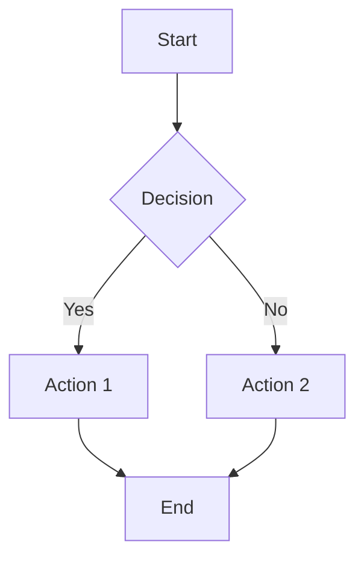
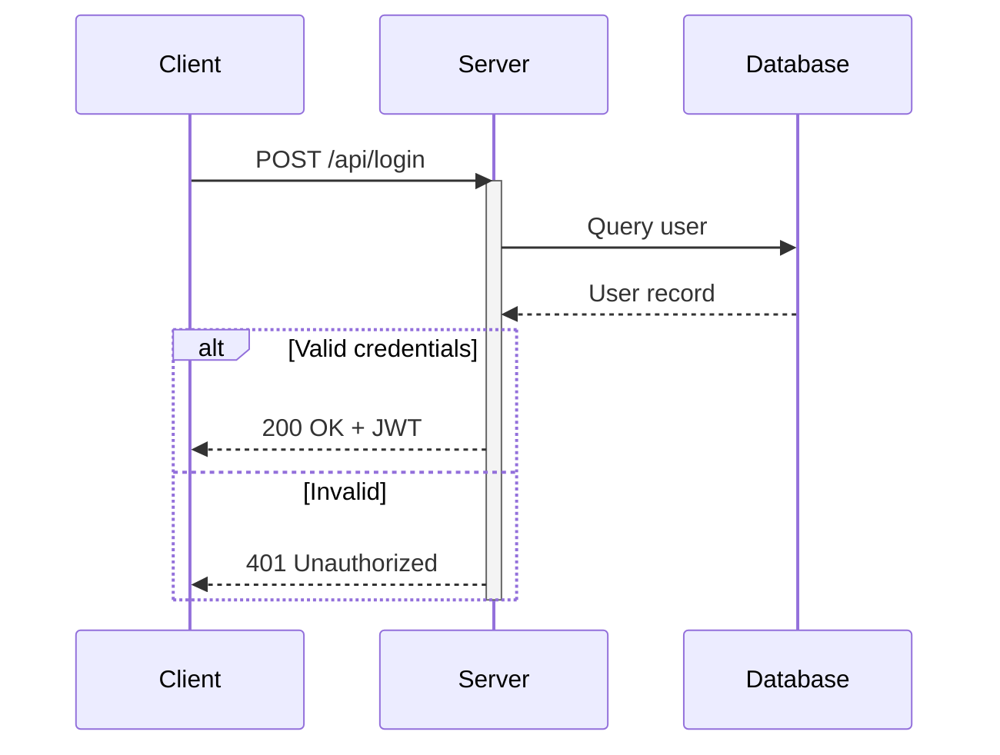
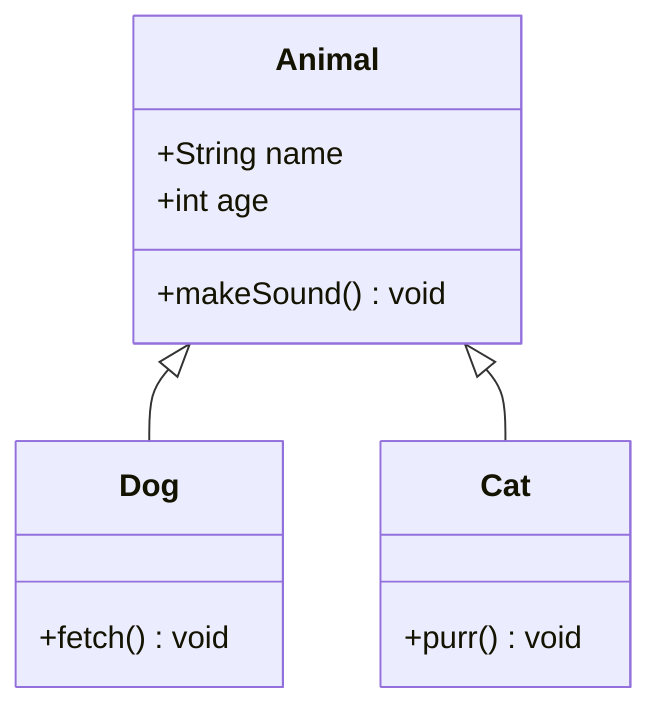
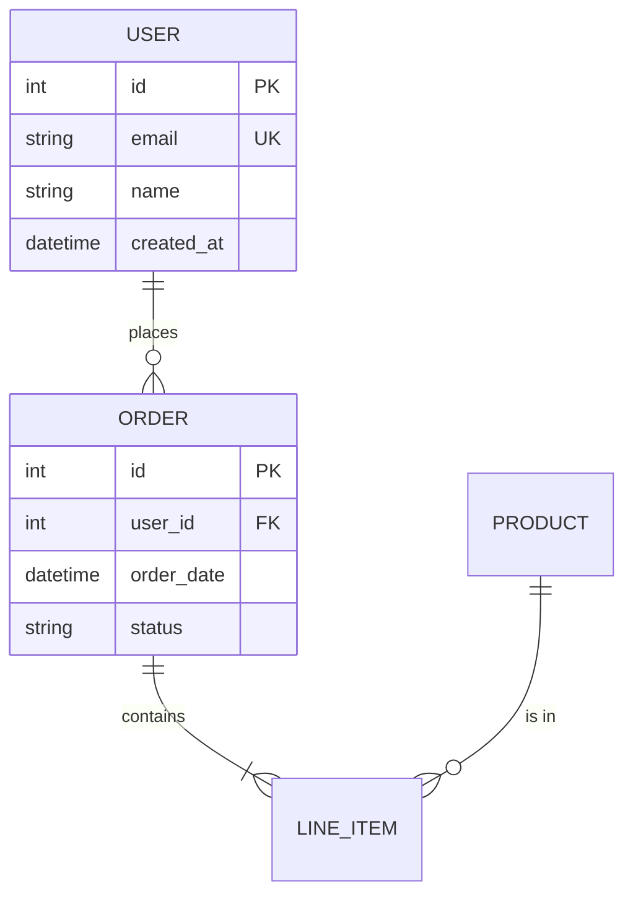
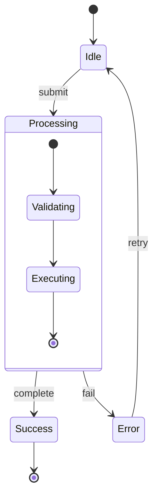
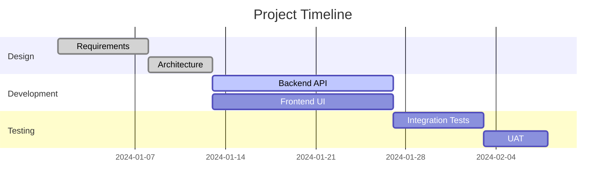
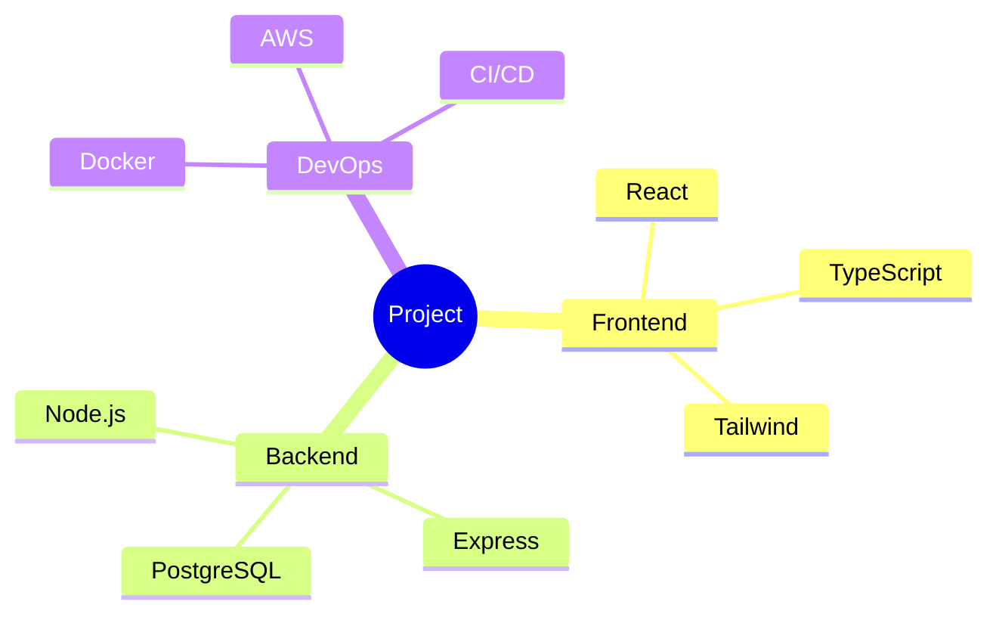
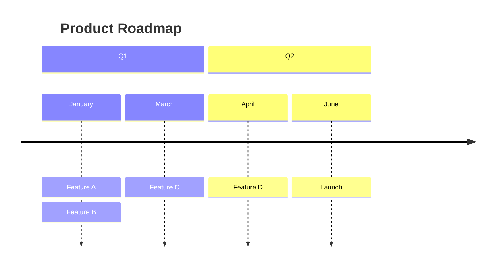
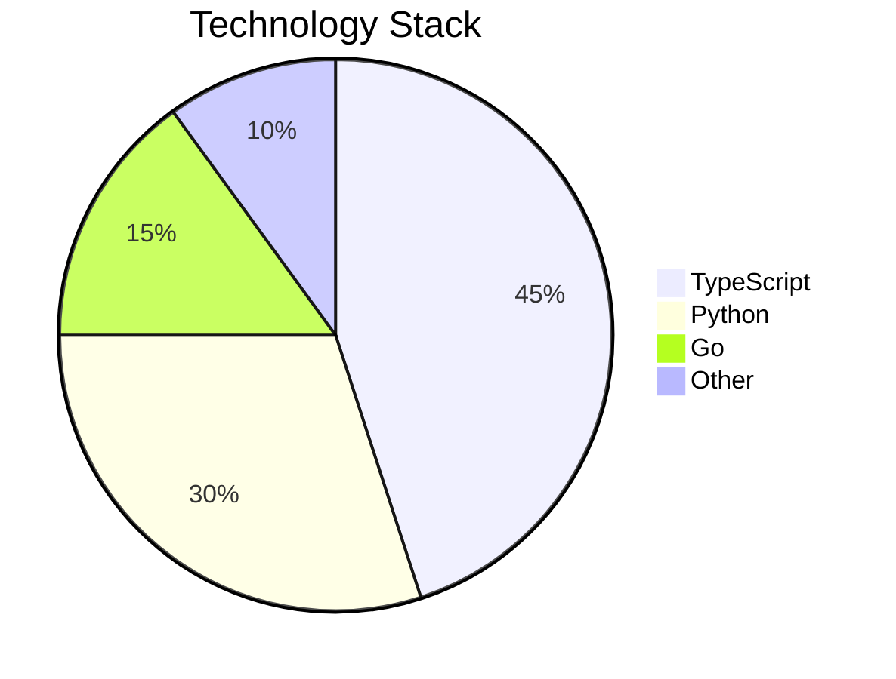
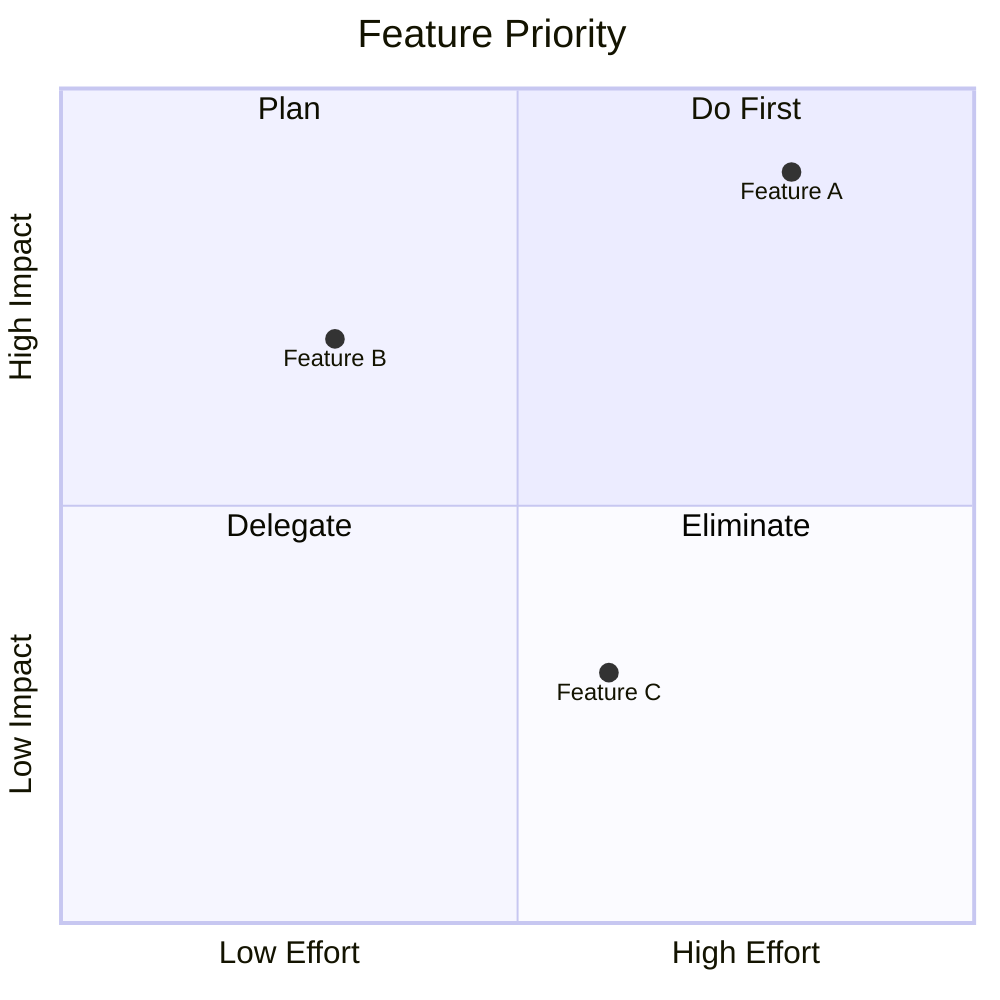

# Mermaid Syntax Quick-Reference

Use `mcp-mermaid` (local, themed) or `diagrams-mcp` / `uml-mcp` (remote) to render Mermaid diagrams.

## Flowchart

**Direction**: `TD` (top-down), `LR` (left-right), `BT` (bottom-top), `RL` (right-left)

**Node shapes**:
- `[text]` — Rectangle
- `(text)` — Rounded
- `{text}` — Diamond (decision)
- `([text])` — Stadium
- `[[text]]` — Subroutine
- `[(text)]` — Cylinder (database)
- `((text))` — Circle
- `>text]` — Asymmetric

**Edge types**:
- `-->` — Arrow
- `---` — Line
- `-.->` — Dotted arrow
- `==>` — Thick arrow
- `-->|label|` — Labeled arrow

## Sequence Diagram

**Arrow types**:
- `->>` — Solid with arrowhead
- `-->>` — Dotted with arrowhead
- `--)` — Solid with open arrow (async)
- `-->)` — Dotted with open arrow

**Blocks**: `alt/else/end`, `opt/end`, `loop/end`, `par/and/end`, `critical/option/end`

## Class Diagram

**Relationships**:
- `<|--` — Inheritance
- `*--` — Composition
- `o--` — Aggregation
- `-->` — Association
- `..>` — Dependency
- `..|>` — Realization

**Cardinality**: `"1" --> "*"`, `"1" --> "0..1"`

## Entity Relationship Diagram

**Cardinality**:
- `||--||` — One to one
- `||--o{` — One to many
- `}o--o{` — Many to many
- `||--o|` — One to zero or one

## State Diagram

## Gantt Chart

## Mind Map

## Timeline

## Pie Chart

## Quadrant Chart

## Styling with mcp-mermaid

When using `mcp-mermaid`, you can customize appearance:

**Themes**: `default`, `dark`, `forest`, `neutral`

**Background colors**: Any CSS color value (e.g., `#ffffff`, `transparent`, `#1a1a2e`)

**Output types**:
- `base64` — Returns base64-encoded PNG
- `svg` — Returns SVG markup
- `file` — Saves PNG to disk (specify path)
- `svg_url` — Returns public mermaid.ink SVG URL
- `png_url` — Returns public mermaid.ink PNG URL

## Tips for Better Diagrams

1. **Keep it readable**: Limit nodes to 15-20 per diagram. Split complex diagrams.
2. **Use meaningful IDs**: `auth_service` not `A1`
3. **Add labels to edges**: Always label decision branches and important connections
4. **Choose direction wisely**: `LR` for processes, `TD` for hierarchies
5. **Use subgraphs**: Group related nodes for clarity
6. **Consistent naming**: Use the same style (camelCase, snake_case) throughout
