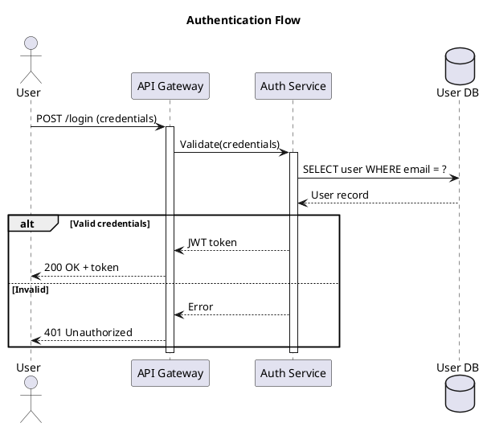
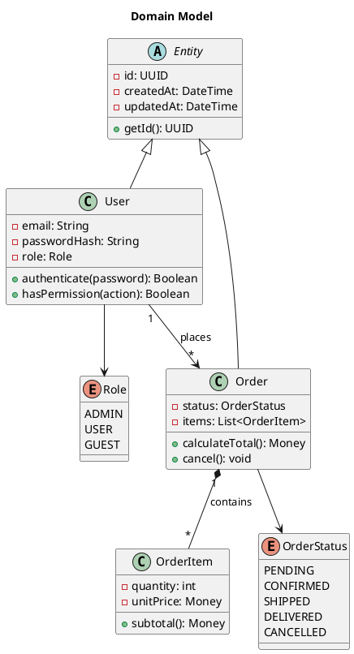
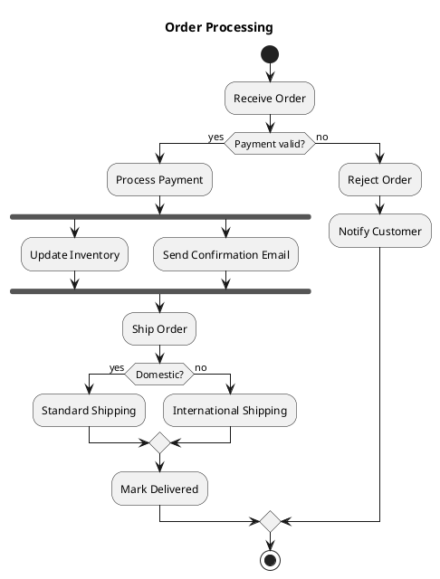
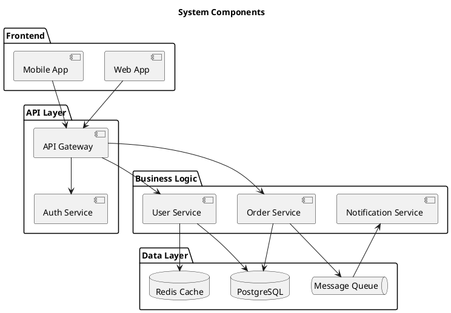
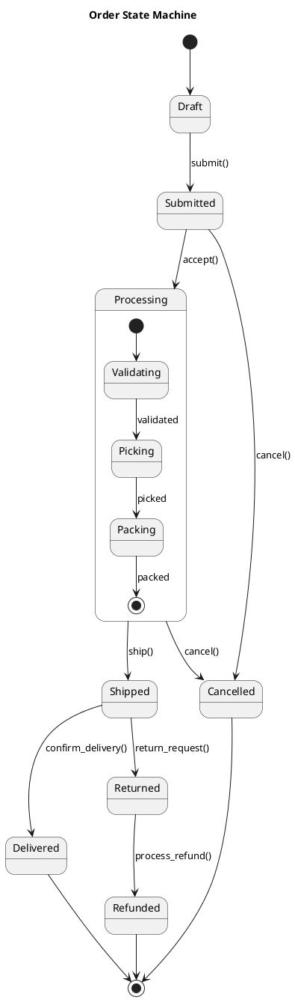
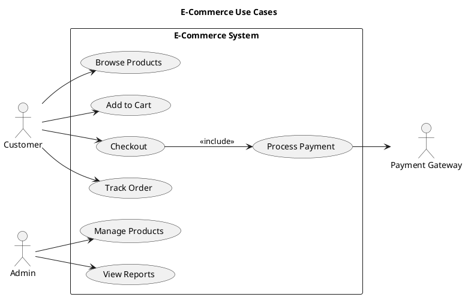
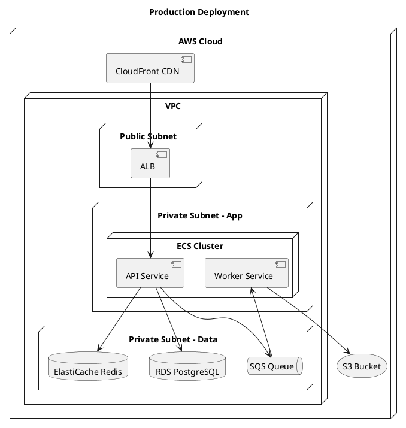

# PlantUML & Kroki Syntax Quick-Reference

Use `uml-mcp` for PlantUML rendering via Kroki, or `diagrams-mcp` for PlantUML via its built-in engine.

## Sequence Diagram



**Arrow types**:
- `->` — Synchronous
- `-->` — Dotted (return)
- `->>` — Async
- `->x` — Lost message
- `->o` — Endpoint

## Class Diagram



**Visibility**:
- `+` Public
- `-` Private
- `#` Protected
- `~` Package

**Relationships**:
- `--|>` — Inheritance
- `--*` — Composition
- `--o` — Aggregation
- `-->` — Association
- `..>` — Dependency
- `..|>` — Implementation

## Activity Diagram



## Component Diagram



## State Diagram



## Use Case Diagram



## Deployment Diagram



## C4 Model (via Kroki/PlantUML)

Use `uml-mcp` with diagram type `c4plantuml`:

```plantuml
@startuml
!include https://raw.githubusercontent.com/plantuml-stdlib/C4-PlantUML/master/C4_Container.puml

title Container Diagram

Person(user, "Customer", "A user of the system")

System_Boundary(system, "E-Commerce Platform") {
    Container(webapp, "Web Application", "React", "Provides UI")
    Container(api, "API Service", "Node.js", "Handles business logic")
    ContainerDb(db, "Database", "PostgreSQL", "Stores data")
    Container(cache, "Cache", "Redis", "Session and data cache")
    ContainerQueue(queue, "Message Queue", "SQS", "Async processing")
}

System_Ext(payment, "Payment Provider", "Processes payments")
System_Ext(email, "Email Service", "Sends notifications")

Rel(user, webapp, "Uses", "HTTPS")
Rel(webapp, api, "Calls", "REST/JSON")
Rel(api, db, "Reads/Writes", "SQL")
Rel(api, cache, "Caches", "Redis protocol")
Rel(api, queue, "Publishes", "SQS")
Rel(api, payment, "Processes payments", "HTTPS")
Rel(queue, email, "Triggers", "HTTPS")
@enduml
```

## Using uml-mcp Tools

### generate_uml
```json
{
  "code": "@startuml\n...\n@enduml",
  "diagram_type": "plantuml",
  "output_format": "svg"
}
```

**Diagram types**: `plantuml`, `mermaid`, `d2`, `graphviz`, `erd`, `bpmn`, `c4plantuml`, `blockdiag`, `tikz`, `nomnoml`, `pikchr`, `structurizr`, `svgbob`, `wavedrom`, `wireviz`

### validate_uml
```json
{
  "code": "@startuml\n...\n@enduml",
  "diagram_type": "plantuml"
}
```

Always validate before rendering complex diagrams to catch syntax errors early.

### generate_uml_batch
```json
{
  "diagrams": [
    {"code": "...", "diagram_type": "plantuml", "output_format": "svg"},
    {"code": "...", "diagram_type": "mermaid", "output_format": "png"}
  ]
}
```

Use batch generation when creating multiple related diagrams (e.g., all C4 levels).

## Tips for Better PlantUML Diagrams

1. **Always use `@startuml` / `@enduml`** wrappers
2. **Add titles**: `title My Diagram` at the top
3. **Use aliases**: `participant "Long Name" as LN` for readability
4. **Group with packages**: Organize related elements visually
5. **Use notes**: `note right of X : explanation` for context
6. **Validate first**: Call `validate_uml` before `generate_uml` for complex diagrams
7. **Choose output format**: SVG for web, PNG for docs, PDF for print
